# Field Report Pipeline

**AI-powered document ingestion pipeline — S3, Lambda, Textract, Bedrock, DynamoDB**



> **Status: In Progress** — Planning and synthetic data preparation phase

---

## The Problem

There are two problems this pipeline solves, and it's worth being clear about both.

**The transition problem.** Field technicians at a water well contractor have been writing on paper since before some of them were born. Asking them to immediately switch to a tablet app creates friction and resistance. The more realistic adoption path is: let them keep writing on paper, but instead of handing the sheet to an office worker who re-types it manually, they snap a photo and upload it. Same habit, one extra step, zero re-typing in the office. Once they're comfortable with that, the paper form gets replaced with a digital one. This pipeline is the bridge that makes that transition possible without a hard cutover.

**The legacy problem.** Years of paper records sitting in filing cabinets. Pump installation reports going back to the 1970s. Flow test data. Service history. Well cleaning records. All of it trapped in paper, queryable only by someone physically pulling folders. A batch run of this pipeline against scanned archives converts that historical data into a searchable database. That has real business value independent of whether anyone ever goes digital-first.

I know this problem firsthand. I worked as a field technician for a water well contractor. While on light duty from a work injury, I spent time scanning paper records — manually organizing decades of job files one page at a time. The pipeline I'm building here is the system I wished existed then.

This is **Project C** of a three-part system:

| Project | Repo | What It Does |
|---|---|---|
| **A — Field Report System** | [field-report-system](https://github.com/leyder-ben/field-report-system) | Serverless submission platform — digital-first path |
| **B — Field Ops Platform** | [field-ops-platform](https://github.com/leyder-ben/field-ops-platform) | EKS GitOps platform running both services in production |
| **C — Field Report Pipeline** | this repo | AI pipeline — paper-first path and archival ingestion |

---

## The Two-Phase Adoption Story

**Phase 1 — Meet them where they are**

- Field tech finishes a job and fills out the same paper form they always have
- Snaps a photo with their phone, uploads via a simple one-button UI
- Pipeline processes automatically — no office re-typing, structured record in the database within 30 seconds
- Office gets an email notification with a plain-English summary of the report
- Supervisor checks the dashboard instead of waiting for Monday morning paper reconciliation
- Zero behavior change for the field crew beyond one photo and one upload

**Phase 2 — Native digital**

- Field tech opens the Field Report app on a tablet (Project A)
- Fills out the same fields they know from the paper form — same structure, digital input
- Submits directly — no paper, no photo, no OCR needed
- This pipeline becomes the legacy bridge for any remaining paper forms or archive scanning

Most technology rollouts fail because they demand too much change too fast. This architecture gives a company a migration path, not an ultimatum. That's the difference between a demo that gets shelved and a system that actually gets deployed.

---

## Architecture

| Component | Service | Role |
|---|---|---|
| Upload UI | S3 static site + presigned URL | Mobile-friendly upload — photo or PDF from phone |
| Intake storage | S3 — intake bucket | Receives uploads, triggers Lambda on object creation |
| Archive storage | S3 — processed bucket | Original file moved here after successful processing |
| Pass 1 — classify | Lambda — extract_report | Groups pages into logical documents, classifies each by type |
| Form structure | AWS Textract | Identifies printed field labels and layout |
| Pass 2 — extract | Lambda — merge_summarize | Extracts fields by document type, writes DynamoDB record |
| Handwriting extraction | Bedrock — Claude 3.5 Sonnet | Reads handwritten values, returns structured JSON |
| Summarization | Bedrock — Claude 3 Haiku | Generates plain-English summary for SNS notification |
| Record storage | DynamoDB — field-reports | Shared table with Projects A and B |
| Office notification | SNS | Email with plain-English summary on every processed document |
| Query API | API Gateway + Lambda | GET /reports — filtered query by tech, type, date range |
| NL Query (Phase 2) | Lambda + Bedrock | POST /query — natural language to DynamoDB filter |
| Observability | CloudWatch | Processing duration metrics, error alarms, dashboard |
| Secrets | Secrets Manager | Nothing sensitive in code or environment variables |
| IaC | Terraform | Every resource provisioned as code |
| CI/CD | GitHub Actions | Deploy all Lambdas on push to main |

---

## Why Two Passes

A naive single-pass pipeline treats every page independently: fire on S3 upload, send each page to Bedrock, extract fields. That works for a simple use case where every uploaded file is a single-page form of a known type.

Real archival job files are not that. A single scanned PDF may contain sales orders, invoices, pump installation reports, correspondence letters, hydrology reports, and service contracts — all interleaved, spanning multiple decades. Multi-page documents have continuation pages with no header, no form title, and no identifying information at the top. A two-page letter looks like two unrelated pages if you process them independently. A three-page hydrology report looks like three unrelated documents.

**Pass 1 — extract_report Lambda**

Fires on S3 object creation. Rasterizes each page of the uploaded PDF and sends pages in batches to Bedrock with context from adjacent pages. Asks Bedrock to group pages into logical documents and classify each group by type. Outputs a page manifest — which pages belong together, what document type each group is.

**Pass 2 — merge_summarize Lambda**

Receives the page manifest from Pass 1. For each identified document group, calls Bedrock with the extraction schema appropriate for that document type. Generates a plain-English summary, writes one DynamoDB record per identified document, archives the original file, and publishes an SNS notification.

Being able to explain why this architecture is necessary — and what breaks without it — is the point. Wiring together an S3 trigger and a Bedrock call is easy. Designing a pipeline that handles real-world document complexity is the actual engineering problem.

---

## Document Types

The pipeline classifies and extracts data from 15 document types:

`sales_order` / `invoice` / `t_and_m` / `pump_install_vt` / `pump_install_sc` / `pump_install_horizontal` / `pump_install_submersible` / `fire_pump_test` / `well_cleaning` / `pumping_test` / `observation_well` / `correspondence_letter` / `hydrology_report` / `service_contract` / `credit_memo` / `other`

---

## Bedrock Prompts

Prompt engineering is a skill and the prompts are a real artifact of this project — not something to hide in environment variables. Full prompt documentation including design rationale and iteration history will be in this section as the build progresses.

**Pass 1 — Classification prompt (Claude 3.5 Sonnet with vision)**

*To be documented during build phase*

**Pass 2 — Extraction prompts (Claude 3.5 Sonnet with vision)**

One prompt per document type. Each prompt specifies the exact JSON schema expected for that form type, with field names derived from the actual physical forms.

*To be documented during build phase*

**Summarization prompt (Claude 3 Haiku)**

*To be documented during build phase*

**Natural language query prompt — Phase 2 (Claude 3 Haiku)**

*To be documented during build phase*

---

## Stack

- **Runtime:** Python 3.12
- **Infrastructure:** Terraform
- **CI/CD:** GitHub Actions with OIDC
- **AWS Services:** Lambda, S3, API Gateway, DynamoDB, SNS, Textract, Bedrock, Secrets Manager, CloudWatch, IAM

---

## Repository Structure

```
field-report-pipeline/
├── lambda/
│   ├── extract_report/         # Pass 1 — page classification and grouping
│   │   ├── handler.py
│   │   └── requirements.txt
│   ├── merge_summarize/        # Pass 2 — field extraction and record write
│   │   ├── handler.py
│   │   └── requirements.txt
│   ├── query/                  # GET /reports — filtered query
│   │   ├── handler.py
│   │   └── requirements.txt
│   └── nl_query/               # POST /query — natural language query (Phase 2)
│       ├── handler.py
│       └── requirements.txt
├── static/
│   └── index.html              # Upload UI — S3 hosted, presigned URL upload
├── infra/                      # Terraform — all AWS resources
│   ├── main.tf
│   ├── variables.tf
│   ├── outputs.tf
│   ├── s3.tf                   # Intake bucket, processed bucket, UI bucket
│   ├── lambda.tf               # All Lambda functions and triggers
│   ├── api_gateway.tf          # Query API and presigned URL endpoint
│   ├── dynamodb.tf             # Shared table import from Project A
│   ├── iam.tf                  # Lambda roles, GitHub Actions OIDC
│   ├── secrets.tf
│   └── cloudwatch.tf           # Processing metrics, alarms, dashboard
├── .github/
│   └── workflows/
│       └── deploy.yml
├── .gitignore
├── CLAUDE.md
└── README.md
```

---

## DynamoDB Schema

**Table:** `field-reports` — shared with Projects A and B
**Partition key:** `report_id` (String — UUID)
**Sort key:** `submitted_at` (String — ISO 8601)

Project C records use `source: 'upload'` and include pipeline-specific attributes:

| Attribute | Type | Notes |
|---|---|---|
| report_id | String (PK) | UUID |
| submitted_at | String (SK) | ISO 8601 |
| source | String | `upload` — identifies pipeline submissions |
| document_type | String | Classified type — see type list above |
| owner | String | Customer/owner name extracted from document |
| job_no | String | Job or sales order number |
| well_no | String | Well number |
| date | String | Date on the document |
| equipment | Map | Make, model, serial — varies by form type |
| measurements | Map | GPM, PSI, water levels — varies by form type |
| notes | String | Free text observations |
| summary | String | Plain-English 2-3 sentence summary |
| extraction_confidence | Number | Textract confidence score 0-1 |
| original_document_key | String | S3 key in processed bucket |
| page_range | String | e.g. `3-4` for multi-page documents |
| processing_duration_ms | Number | Total pipeline processing time |

---

## Synthetic Test Data

All test data uses fictional companies and personnel. No real customer or operational data is used anywhere in this repository.

Test fixtures are synthetic job files for a fictional water well contractor — Wolverine Water, Inc. of Millbrook, Indiana. Four job files totaling 55 pages cover two fictional customers and span 1979–1995. The files include every document type the pipeline needs to handle, with deliberate boundary detection test cases: multi-page letters with continuation pages that have no letterhead, pumping test reports that span two pages with a blank header on the second page, and a three-page hydrology report where pages 2 and 3 are plain typed text with no identifying information.

The decision to use synthetic data rather than real client records is intentional and worth stating explicitly — it reflects the same data handling judgment that would apply in any production context.

---

## Troubleshooting

*Real issues encountered and resolved during the build — documented here because these are the kinds of problems that don't show up in tutorials.*

*Entries will be added as the build progresses.*

---

## About This Project

Built as part of a portfolio demonstrating AWS cloud engineering skills — AI-powered document processing, serverless architecture, infrastructure as code, and CI/CD automation. The problem domain comes from firsthand experience working as a field technician and spending time on light duty scanning paper records that this pipeline would have processed automatically.
